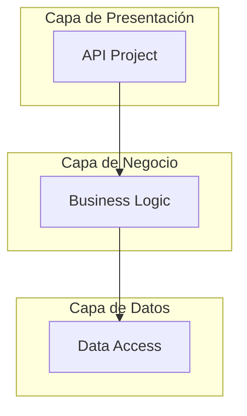
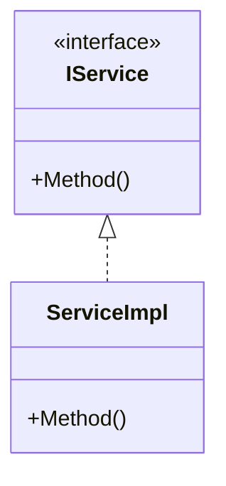
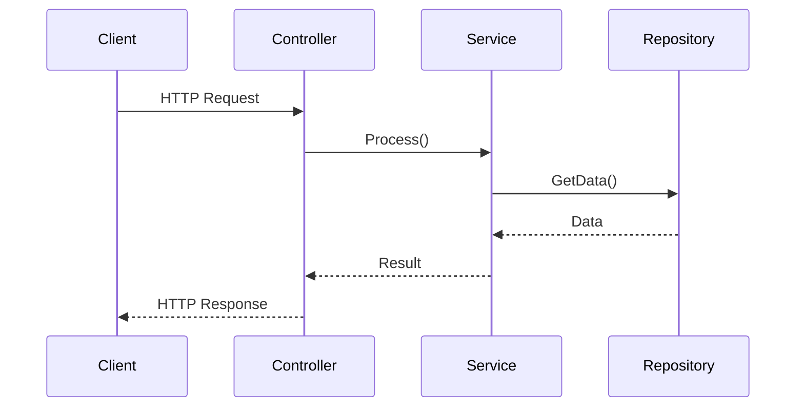

# Prompt para Generar Documentación de Solución .NET

## Instrucciones Principales

Necesito que generes un archivo de documentación en formato Markdown para una solución .NET. La documentación debe ser completa, profesional y fácil de entender para desarrolladores que se unan al proyecto.

## Estructura del Documento

### 1. Encabezado y Descripción General
- Título de la solución
- Descripción breve del propósito de la solución
- Tecnologías principales utilizadas (.NET version, frameworks, librerías clave)
- Tabla de contenidos

### 2. Arquitectura General de la Solución
- Descripción narrativa de la arquitectura global
- Diagrama general de la solución en Mermaid mostrando:
  - Todos los proyectos y sus relaciones
  - Flujo de datos entre componentes
  - Dependencias externas (bases de datos, APIs, servicios)
  - Capas arquitectónicas (presentación, negocio, datos, infraestructura)

### 3. Documentación de Cada Proyecto

Para **cada proyecto** en la solución, incluir:

#### 3.1. Definición del Proyecto
- **Nombre**: Nombre completo del proyecto
- **Tipo**: (API, Library, Console, Web, Tests, etc.)
- **Propósito**: Descripción detallada de su responsabilidad
- **Tecnologías**: Frameworks y paquetes NuGet principales
- **Dependencias**: Otros proyectos de los que depende

#### 3.2. Diagrama de Componentes
Crear un diagrama Mermaid que muestre:
- Clases principales, interfaces y servicios
- Organización en carpetas/namespaces
- Relaciones entre componentes (composición, herencia, dependencia)
- Patrones de diseño aplicados

#### 3.3. Diagrama de Secuencia
Crear diagramas Mermaid para los flujos principales:
- Flujos de operaciones CRUD si aplica
- Procesos de negocio importantes
- Interacciones entre capas
- Llamadas a servicios externos
- Manejo de excepciones

### 4. Secciones Adicionales
- **Configuración**: Variables de entorno, appsettings requeridos
- **Instalación**: Pasos para configurar el proyecto localmente
- **Ejecución**: Comandos para compilar y ejecutar
- **Testing**: Estrategia de pruebas y cómo ejecutarlas
- **Deployment**: Proceso de despliegue

## Formato de Diagramas Mermaid

Utiliza la sintaxis correcta de Mermaid:

**Para diagrama general de solución:**


**Para diagrama de componentes:**


**Para diagrama de secuencia:**


## Información de la Solución a Documentar

[AQUÍ PROPORCIONA LA INFORMACIÓN DE TU SOLUCIÓN]

**Estructura de proyectos:**
- Proyecto 1: [Nombre y tipo]
- Proyecto 2: [Nombre y tipo]
- ...

**Arquitectura aplicada:** [N-Capas / DDD / etc.]

**Principales funcionalidades:**
1. [Funcionalidad 1]
2. [Funcionalidad 2]
3. ...

**Integraciones externas:** [APIs, bases de datos, servicios cloud, etc.]

## Ejemplo de Salida Esperada

El documento generado debe verse así:

```markdown
# MiSolucion.NET

## Descripción
[Descripción completa]

## Tecnologías
- .NET 8.0
- Entity Framework Core
- ...

## Tabla de Contenidos
1. [Arquitectura General](#arquitectura-general)
2. [Proyectos](#proyectos)
   - [API](#proyecto-api)
   - [Core](#proyecto-core)
   ...

## Arquitectura General
[Descripción narrativa]

[Diagrama Mermaid]

## Proyectos

### Proyecto: MiSolucion.API

#### Definición
- **Nombre**: MiSolucion.API
- **Tipo**: ASP.NET Core Web API
- ...

#### Diagrama de Componentes
[Diagrama Mermaid]

#### Diagramas de Secuencia
##### Flujo de Autenticación
[Diagrama Mermaid]
...
```

## Notas Importantes
- Usa nomenclatura consistente en español o inglés (define cuál prefieres)
- Los diagramas deben ser claros y no sobrecargados
- Incluye comentarios explicativos donde sea necesario
- Mantén un nivel de detalle apropiado (ni muy alto ni muy bajo)
- Asegúrate de que todos los diagramas Mermaid tengan sintaxis válida