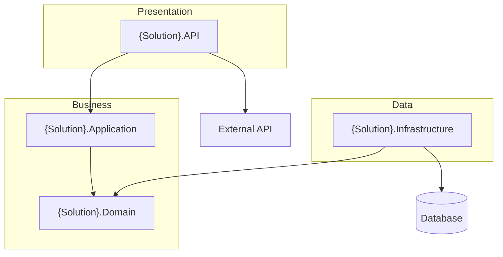
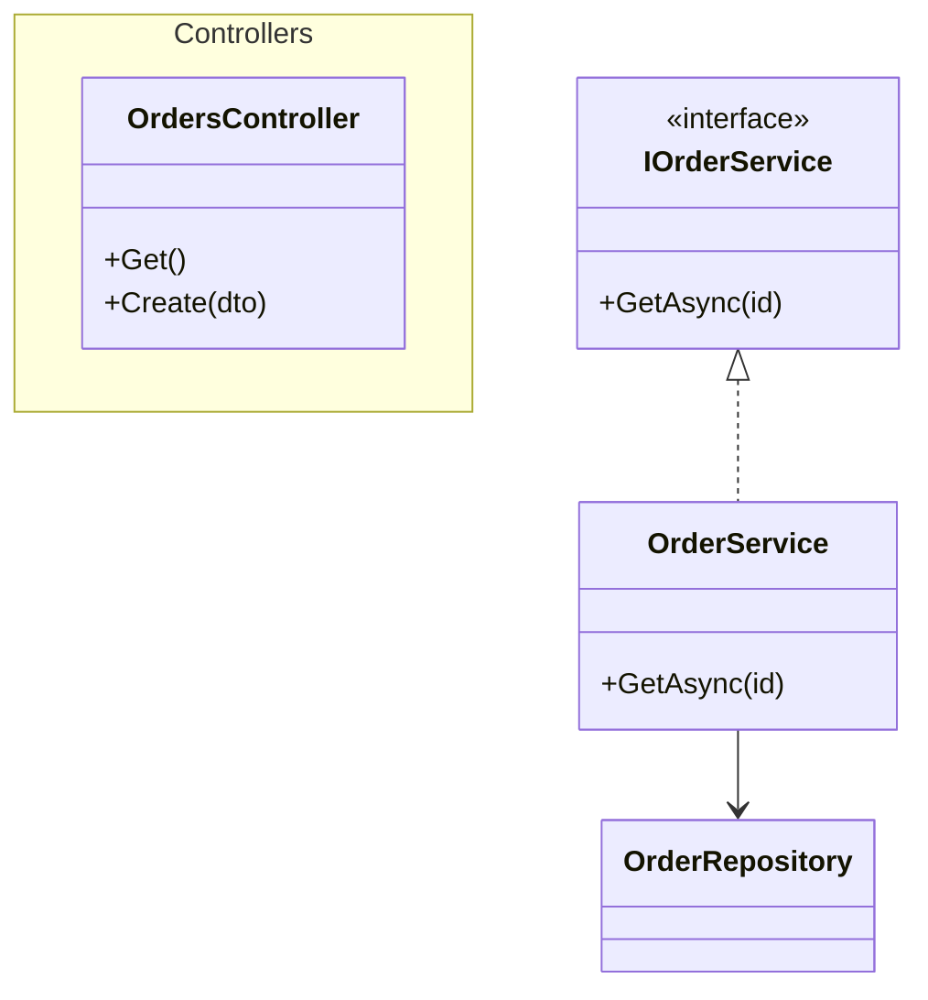
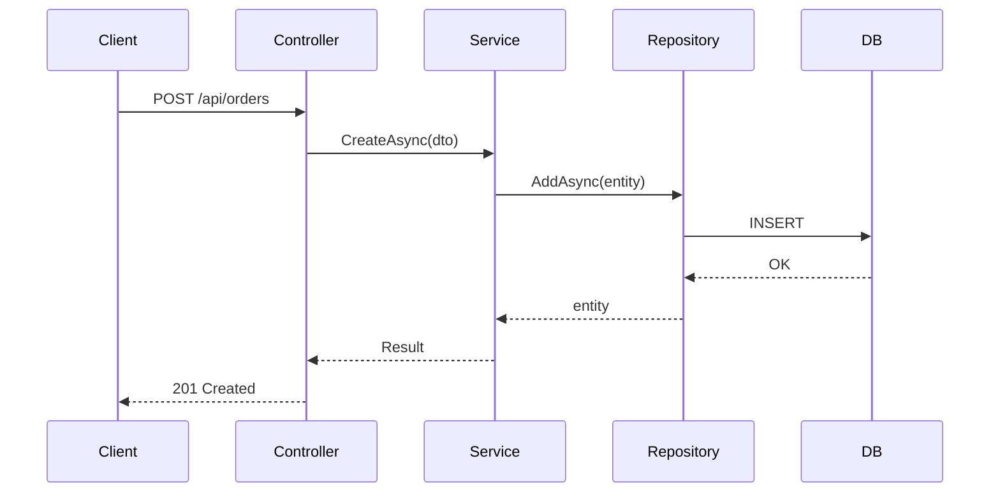

# DOCUMENTATION.md Template

Use this structure for the main documentation file. Write all content in the language chosen by the user (English or Spanish) and keep terminology consistent throughout. Replace every placeholder with real data gathered during analysis — never leave placeholders in the final output.

---

## Structure

````markdown
# {Solution Name}

## Description

{2–4 sentences: what the solution does, the business problem it solves, and who uses it.}

## Technologies

| Category | Technology |
|---|---|
| Runtime | .NET {version} |
| Framework | {ASP.NET Core / Blazor / MAUI / Worker Service / ...} |
| Data access | {EF Core x.y / Dapper / ...} |
| Database | {SQL Server / PostgreSQL / ...} |
| Key libraries | {top NuGet packages with purpose} |
| Testing | {xUnit / NUnit / MSTest + assertion/mocking libs} |
| Deployment | {Docker / Azure / CI pipeline / ...} |

## Table of Contents

1. [Overall Architecture](#overall-architecture)
2. [Projects](#projects)
   - [{Project 1}](#project-{slug-1})
   - [{Project 2}](#project-{slug-2})
3. [Configuration](#configuration)
4. [Installation](#installation)
5. [Running](#running)
6. [Testing](#testing)
7. [Deployment](#deployment)

## Overall Architecture

{Narrative: architectural style (Clean Architecture, N-Layer, DDD, Vertical Slice...),
dependency direction between projects, where the domain rules live, how requests flow
from the entry point to the data store, and how external systems are integrated.}



{Legend or notes: arrow meaning, layer responsibilities, notable constraints
(e.g., "Domain has no external dependencies").}

## Projects

### Project: {Project.Name}

#### Definition

| Attribute | Value |
|---|---|
| **Name** | {full project name} |
| **Type** | {ASP.NET Core Web API / Class Library / Console / Worker / xUnit Tests / ...} |
| **Target** | {net8.0 / net9.0 / ...} |
| **Purpose** | {1–3 sentences describing its responsibility in the solution} |
| **Key packages** | {main PackageReferences} |
| **Depends on** | {ProjectReference list with one-line reason each} |

#### Component Diagram

{One paragraph summarizing the internal organization: folders/namespaces and their roles.}



Rules for this diagram:
- Show the main classes, interfaces, services, and their relationships (inheritance `<|--`, implementation `<|..`, composition `*--`, dependency `-->`).
- Group by namespace/folder with `namespace` blocks or notes when it improves clarity.
- Keep it under ~15 elements; split into multiple diagrams per area if larger.

#### Sequence Diagrams

{One sequence diagram per main flow: CRUD operations, authentication, business processes,
external calls, background jobs. Include exception handling branches when relevant.}

##### {Flow name, e.g., "Create Order"}



{Repeat the "### Project: ..." section for EVERY project in the solution, including test projects.}

## Configuration

| Key / Variable | Location | Required | Description |
|---|---|---|---|
| `ConnectionStrings:{Name}` | appsettings.json / user-secrets | Yes | {purpose} |
| `{Section}:{Key}` | appsettings.json | Yes/No | {purpose} |
| `{ENV_VAR}` | environment | Yes/No | {purpose} |

{Notes about environment-specific files (appsettings.Development.json), user secrets setup,
and any values that must never be committed.}

## Installation

```bash
# prerequisites check
dotnet --version

# restore and build
git clone {repo}
cd {folder}
dotnet restore
dotnet build
```

{Additional steps: database creation/migration commands, seeding, Docker compose for local
dependencies, etc.}

## Running

```bash
dotnet run --project src/{StartupProject}
```

{List launch profiles, ports/URLs from launchSettings.json, and how to reach the main entry
points (e.g., Swagger URL).}

## Testing

{Strategy summary: unit vs integration tests, what each test project covers.}

```bash
dotnet test
```

{How to run a single project's tests, filter tests, and any test infrastructure requirements
(e.g., testcontainers, in-memory DB).}

## Deployment

{Describe the deployment process found in the repository: Docker image build, CI/CD pipeline
stages, target environments, publish commands. If nothing is found, state:
"No deployment configuration was found in the repository."}
````

---

## Quality Checklist (verify before delivering)

- [ ] Every project in the `.sln` has its own section, including test projects
- [ ] All `ProjectReference`s are reflected in "Depends on" and in the solution diagram
- [ ] All Mermaid blocks pass the syntax rules in `mermaid-guide.md`
- [ ] All TOC anchors match heading slugs exactly
- [ ] No placeholders, no invented types — everything traceable to source code
- [ ] Consistent language (all English or all Spanish) and consistent naming
