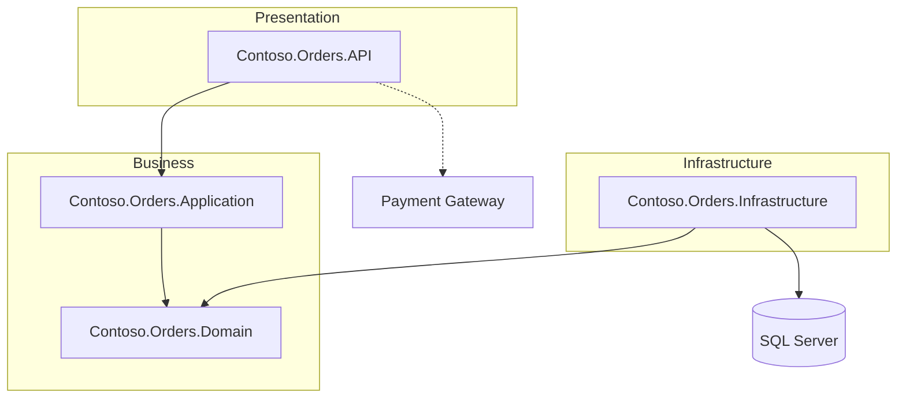
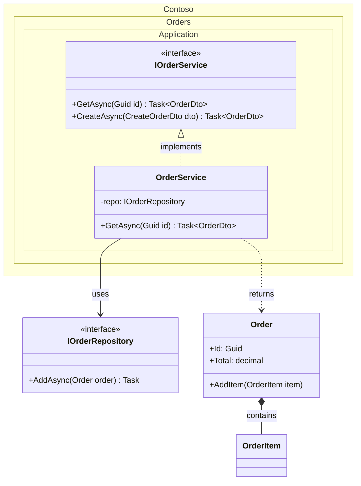
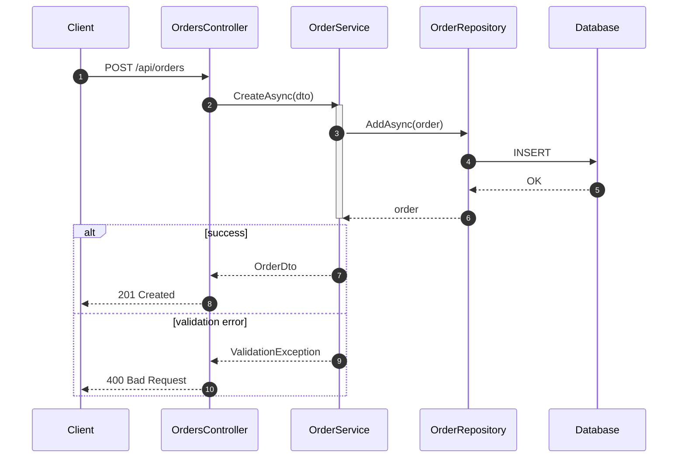

# Mermaid UML Guide for .NET Documentation

Syntax rules and validation checklist for the three diagram types used by this skill. Every ` ```mermaid ` block written into DOCUMENTATION.md or ONBOARDING.md must comply with this guide.

## General Rules (all diagram types)

1. Wrap diagrams in fenced code blocks with the `mermaid` language tag.
2. Diagram type keyword must be the first token: `graph`, `flowchart`, `classDiagram`, `sequenceDiagram`.
3. Node IDs: alphanumeric + underscores only (`API`, `OrderService`, `DB_1`). No spaces, dots, or hyphens in raw IDs. Use quoted labels for display text: `API["MySolution.API"]`.
4. Labels containing special characters (`.`, `()`, `-`, `:`) MUST be wrapped in double quotes.
5. Keep diagrams focused: max ~15 nodes/elements. Split bigger systems into multiple diagrams.
6. Avoid reserved keywords as identifiers (`end`, `graph`, `subgraph`, `participant`, `class`).
7. Subgraphs require a matching `end`. Subgraph titles with spaces go in quotes: `subgraph "Presentation Layer"`.

## 1. Solution Architecture — `flowchart`

Use `flowchart TB` (top-to-bottom) or `flowchart LR` (left-to-right) for the solution overview: projects, layers, data flow, external dependencies.



Node shapes:
- `A[Label]` rectangle (projects, services)
- `A[(Label)]` cylinder (databases)
- `A((Label))` circle (events/queues)
- `A{Label}` diamond (decisions)

Edge styles:
- `-->` solid dependency/data flow
- `-.->` dashed (external/optional call)
- `-->|label|` labeled edge

## 2. Components — `classDiagram`

Use for classes, interfaces, and relationships inside a project.



Relationship arrows:
| Syntax | Meaning |
|---|---|
| `<\|--` | inheritance |
| `<\|..` | interface implementation |
| `-->` | association / dependency |
| `..>` | usage (returns, creates) |
| `*--` | composition |
| `o--` | aggregation |

Member syntax: `+` public, `-` private, `#` protected. Stereotypes with `<<interface>>`, `<<abstract>>`, `<<static>>`.
**Important:** generic types must use tildes: `List~Order~`, `Task~OrderDto~` (angle brackets break parsing).

## 3. Flows — `sequenceDiagram`

Use for CRUD flows, business processes, cross-layer interactions, external calls, exception handling.



Message arrows:
- `->>` solid with arrowhead (call)
- `-->>` dashed (return/response)
- `->` solid without arrowhead, `-)` async message

Extras: `autonumber`, `activate X` / `deactivate X` lifelines, `alt/else/end` branches, `loop` blocks, `Note over X,Y: text`, `rect rgb(...)` highlighting. Participant aliases: `participant C as Client`.

## Validation Checklist (run before writing each block)

1. First line is a valid diagram type keyword.
2. All subgraph/alt/loop blocks have a closing `end`.
3. Every node/participant used in an edge is declared or implicitly created consistently (same ID everywhere — watch for typos).
4. No `<` or `>` in class members (use `~Type~`); labels with special chars are quoted.
5. No reserved keyword used as an ID.
6. Arrows use valid tokens (`-->`, `-.->`, `<|..`, `->>`, `-->>`).
7. Block renders in a single diagram type — never mix flowchart and sequence syntax in one block.
8. If unsure, simplify: fewer elements with accurate relationships beat exhaustive diagrams that fail to render.
