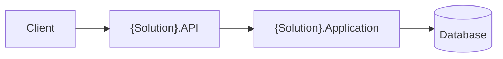

# ONBOARDING.md Template

Use this structure for the onboarding guide. The audience is a developer on their first week: task-oriented, concrete, and fast to first success. Write in the same language as DOCUMENTATION.md. Link to DOCUMENTATION.md sections instead of duplicating deep content.

---

## Structure

````markdown
# Onboarding — {Solution Name}

Welcome! This guide gets you from zero to running the {solution name} locally in under 10 minutes,
then walks you through the codebase and your first common tasks.

> For full architecture and project details, see [DOCUMENTATION.md](./DOCUMENTATION.md).

## 1. Prerequisites

| Requirement | Version | Notes |
|---|---|---|
| .NET SDK | {from global.json / csproj TFM} | check with `dotnet --version` |
| {IDE} | {any} | e.g., Visual Studio 2022 / Rider / VS Code + C# Dev Kit |
| {Database} | {version or "Docker"} | local instance or container |
| {Other tools} | {version} | e.g., Docker Desktop, EF Core CLI, Azurite |

## 2. First Run

```bash
git clone {repo}
cd {folder}
dotnet restore
dotnet build
{database setup: dotnet ef database update / docker compose up -d / seed command}
dotnet run --project {startup project}
```

**You know it works when:** {concrete success signal — e.g., "Swagger opens at
https://localhost:5001/swagger and GET /api/health returns 200."}

### Troubleshooting first run

| Symptom | Cause | Fix |
|---|---|---|
| {common error} | {why} | {command or config change} |

## 3. Key Systems & How They Connect

{Simplified architecture diagram — reuse a trimmed version of the solution diagram
from DOCUMENTATION.md: entry points, core services, data stores, external systems.}



{2–4 bullets: request lifecycle in one breath, where business rules live, where data
access lives, what is external. Link to [Architecture](./DOCUMENTATION.md#overall-architecture).}

## 4. Project Structure Map

```
{solution root}/
├── src/
│   ├── {Api}/          ← {one-line role}
│   ├── {Core}/         ← {one-line role}
│   └── {Infrastructure}/ ← {one-line role}
├── tests/
│   └── {Tests}/        ← {one-line role}
└── {docs, docker, ci folders}/
```

**Where do I find...**

| I want to... | Look in |
|---|---|
| Add a new endpoint | {folder/file pattern} |
| Change a business rule | {folder} |
| Add/modify a table | {DbContext + migrations folder} |
| Change configuration | appsettings.json + {section} |
| Add a background job | {folder} |

## 5. Common Tasks (Walkthroughs)

### Run the test suite

```bash
dotnet test
```
{Any filters or setup worth knowing.}

### {Task: e.g., "Add a new API endpoint"}

1. {step with real file paths}
2. {step}
3. {how to verify}

### {Task: e.g., "Add an entity / migration"}

1. {step}
2. {step}

### {Task: e.g., "Call an external service"}

{step-by-step pointing at the existing integration pattern in the codebase}

## 6. Configuration You'll Touch

{Short table of the settings a developer actually edits locally: connection strings,
feature flags, secrets setup command (`dotnet user-secrets set ...`).}

## 7. Testing & Quality Bar

- {how to run tests, coverage expectations}
- {lint/format commands: `dotnet format`, analyzers}
- {CI: what runs on PR}

## 8. Next Steps & People to Ask

- Read: [Full documentation](./DOCUMENTATION.md)
- {First good issue / area to explore}
- | Topic | Ask |
  |---|---|
  | {area} | {team/person/channel placeholder → replace with real owners if known} |
````

---

## Quality Checklist (verify before delivering)

- [ ] "First Run" section is reproducible from the actual repo commands and launch profiles
- [ ] Success signal is concrete and verifiable
- [ ] Diagrams reuse real project names from the solution
- [ ] Every walkthrough references real paths/patterns that exist in the codebase
- [ ] No invented people/teams — use placeholders only where the user will fill in owners
- [ ] Same language as DOCUMENTATION.md; cross-links resolve
