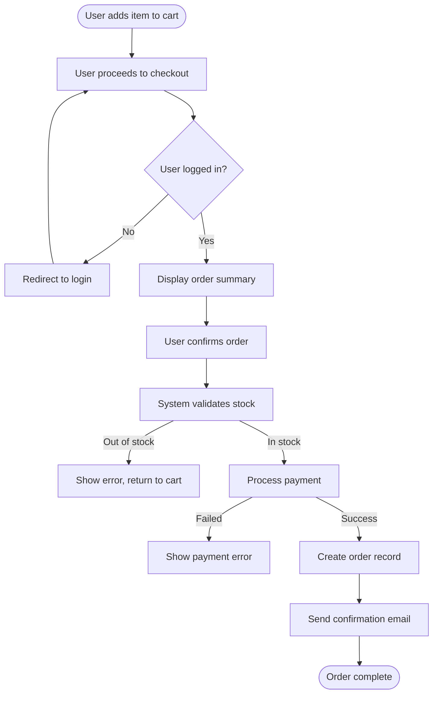

# Functional Requirements Writer

An expert agent skill that reads business specification documents in any format, understands
the embedded business rules, and produces a clean, structured Functional Requirements Document
(FRD) in Markdown — written in simple, unambiguous language that both technical and non-technical
stakeholders can understand.

---

## Workflow Overview

Follow these phases strictly, one at a time, communicating progress at each step.

```
Phase 1 → Collect & Inventory Files
Phase 2 → Read & Parse Each Document
Phase 3 → Extract Business Rules & Domain Concepts
Phase 4 → Clarify Ambiguities (ask user if needed)
Phase 5 → Structure the FRD
Phase 6 → Write the FRD in Markdown
Phase 7 → Review & Deliver
```

---

## Phase 1 — Collect & Inventory Files

**Goal:** Know what you're working with before reading anything.

1. List all uploaded files from `/mnt/user-data/uploads/`.
2. For each file, record:
   - Filename and extension
   - Estimated role (e.g., "main spec", "data model", "pricing rules", "UI wireframes")
3. Present the inventory to the user and confirm before proceeding.
4. Ask: *"Are there any files missing, or any context I should know before I start reading?"*

**Supported formats:** `.pdf`, `.docx`, `.xlsx`, `.xls`, `.csv`, `.txt`, `.md`

> For reading strategy per file type, see → `references/file-reading-guide.md`

---

## Phase 2 — Read & Parse Each Document

**Goal:** Extract raw content from every file without losing structure.

Process files one by one. For each:

1. Announce which file you are reading: *"Reading [filename]..."*
2. Apply the correct reading strategy (see `references/file-reading-guide.md`).
3. Capture:
   - Section headings and hierarchy
   - Business rules (explicit and implied)
   - Actors / roles / personas mentioned
   - System actions and triggers
   - Data fields, validations, constraints
   - Workflows and process steps
   - Exceptions and edge cases
   - Any tables with rules or configurations
4. Tag each extracted item with its source file and location (page/sheet/section).
5. Store findings in an internal working structure (see schema below).

### Internal Working Schema

```
{
  source: "filename.pdf | sheet: 'Rules' | row 12",
  type: "business_rule | actor | workflow | data_field | validation | exception",
  content: "raw extracted text or paraphrase",
  priority: "must | should | may | tbd",
  ambiguous: true | false
}
```

---

## Phase 3 — Extract Business Rules & Domain Concepts

**Goal:** Turn raw content into a unified, deduplicated knowledge base.

After reading all files:

1. **Deduplicate** — merge rules that appear in multiple documents.
2. **Classify** each item:
   - **Actor** — who uses the system (user, admin, system, external service)
   - **Feature / Module** — functional area it belongs to
   - **Business Rule** — a constraint, condition, or policy
   - **Data Requirement** — fields, types, validations
   - **Workflow** — ordered sequence of steps or states
   - **Exception / Edge Case** — what happens when things go wrong
   - **Non-Functional Hint** — performance, security, compliance notes
3. **Detect contradictions** — flag rules in different documents that conflict.
4. **Mark ambiguities** — anything unclear, incomplete, or that requires assumptions.
5. Build a **Feature Map**: group all rules under logical functional modules.

> For classification examples and patterns, see → `references/classification-guide.md`

---

## Phase 4 — Clarify Ambiguities

**Goal:** Fill gaps before writing. Never assume silently.

1. List every ambiguity or contradiction found (numbered list).
2. Group them: *Critical* (blocks writing) vs. *Minor* (can use reasonable assumption).
3. For critical gaps, ask the user directly.
4. For minor gaps, state your assumption clearly and ask for confirmation.
5. Document all assumptions — they will appear in the FRD.

**Example output:**

```
❓ Ambiguities Found:

Critical:
1. [auth.pdf p.3] — The document mentions "two-factor authentication" but doesn't specify
   which second factor is supported (SMS, email, authenticator app, or all).
   → Please clarify.

Minor (I'll assume unless you correct me):
2. [rules.xlsx Sheet2] — Password expiry is mentioned but no timeframe given.
   → I'll assume 90 days (industry standard). Correct?
```

---

## Phase 5 — Structure the FRD

**Goal:** Plan the document outline before writing prose.

Present the proposed FRD structure to the user for approval:

```markdown
# Functional Requirements Document — [Project Name]

1. Introduction
   1.1 Purpose
   1.2 Scope
   1.3 Definitions & Glossary
   1.4 Assumptions & Constraints
   1.5 Document Conventions

2. System Overview
   2.1 Context Description
   2.2 Actors & Roles
   2.3 High-Level Feature Map

3. Functional Requirements
   [One section per Feature/Module, e.g.:]
   3.1 User Authentication
   3.2 Product Catalog
   3.3 Order Management
   ...

4. Business Rules
   4.1 [Module] Rules
   ...

5. Data Requirements
   5.1 Data Entities
   5.2 Field Validations
   5.3 Data Constraints

6. Workflows & Process Flows
   6.1 [Workflow Name] — step by step

7. Exception & Error Handling

8. Non-Functional Requirements (if found)

9. Open Questions & Future Considerations

Appendix A: Assumptions Log
Appendix B: Source Document Index
```

Ask the user: *"Does this structure work, or would you like to add/remove/reorder sections?"*

---

## Phase 6 — Write the FRD in Markdown

**Goal:** Produce the full document, section by section, step by step.

### Writing Rules (follow strictly)

1. **Simple language** — write at 8th-grade reading level. No jargon unless defined in glossary.
2. **Active voice** — "The system sends an email" not "An email is sent by the system."
3. **One requirement = one statement** — never bundle two rules into one sentence.
4. **Use RFC keywords consistently:**
   - **MUST** / **SHALL** → mandatory
   - **SHOULD** → recommended
   - **MAY** / **CAN** → optional
5. **Unique IDs for every requirement:**
   - Format: `[MODULE-TYPE-NNN]` e.g., `AUTH-FR-001`, `ORD-BR-012`, `USR-DR-003`
   - Types: `FR` (Functional Req), `BR` (Business Rule), `DR` (Data Req), `WF` (Workflow)
6. **Cite the source** for each requirement: *(Source: filename.pdf, Section 3.2)*
7. **Tables for data fields** — never prose for structured data.
8. **Mermaid diagrams** for workflows when 3+ steps exist.
9. **Write section by section** — announce each section before writing it.

### Section Writing Pattern

For each section:
```
🖊️ Writing Section [N]: [Title]...
[Write the full section content]
✅ Section [N] complete.
```

### Functional Requirement Block Format

```markdown
#### AUTH-FR-001 — User Login

The system MUST allow registered users to log in using their email address and password.

- The email address MUST be validated against the format `user@domain.com`.
- The password field MUST be masked during input.
- After 5 consecutive failed attempts, the system MUST lock the account for 15 minutes.
- The system MUST display a generic error message that does not reveal whether the
  email or password was incorrect.

**Priority:** High
**Source:** auth-spec.pdf, Section 2.1
**Related Rules:** AUTH-BR-003, AUTH-BR-004
```

### Business Rule Block Format

```markdown
#### AUTH-BR-003 — Account Lockout Policy

| Attribute     | Value                              |
|---------------|------------------------------------|
| ID            | AUTH-BR-003                        |
| Description   | Lock account after failed attempts |
| Trigger       | 5 consecutive failed login attempts|
| Consequence   | Account locked for 15 minutes      |
| Reset         | Automatically after lockout period |
| Exception     | Admin can unlock manually          |
| Priority      | Must                               |
| Source        | security-rules.xlsx, Sheet "Auth"  |
```

### Workflow Block Format

```markdown
#### ORD-WF-001 — Order Placement Flow



**Steps:**
1. User adds at least one item to the cart.
2. User initiates checkout.
3. System checks authentication — redirects to login if not logged in.
4. ...

**Source:** order-process.docx, Section 4
```

---

## Phase 7 — Review & Deliver

**Goal:** Package and hand off the final document.

1. Write the complete FRD as a single `.md` file.
2. Save to `/mnt/user-data/outputs/functional-requirements-document.md`.
3. Present a **summary card** to the user:

```
📄 FRD Complete

Sections written:     9 sections + 2 appendices
Requirements logged:  [N] functional requirements
Business rules:       [N] rules
Data entities:        [N] entities
Workflows:            [N] diagrams
Assumptions made:     [N] (see Appendix A)
Open questions:       [N] (see Section 9)

Source documents used: [list filenames]
```

4. Ask: *"Would you like me to revise any section, add missing requirements, or export this to Word/PDF?"*

---

## Reference Files

| File | When to read |
|------|-------------|
| `references/file-reading-guide.md` | Phase 2 — before reading any file |
| `references/classification-guide.md` | Phase 3 — when classifying extracted items |
| `references/frd-quality-checklist.md` | Phase 7 — before final delivery |

---

## Error Handling

| Situation | Action |
|-----------|--------|
| File cannot be read | Report the error, skip the file, continue with others, flag in Appendix B |
| Conflicting rules in different documents | Flag in Phase 4, ask user to resolve |
| No files uploaded | Ask the user to upload specification documents before proceeding |
| File is image-only PDF (scanned) | Note OCR limitation, extract what's visible, flag uncertain extractions |
| Empty or near-empty file | Note it, skip it, do not block the workflow |
