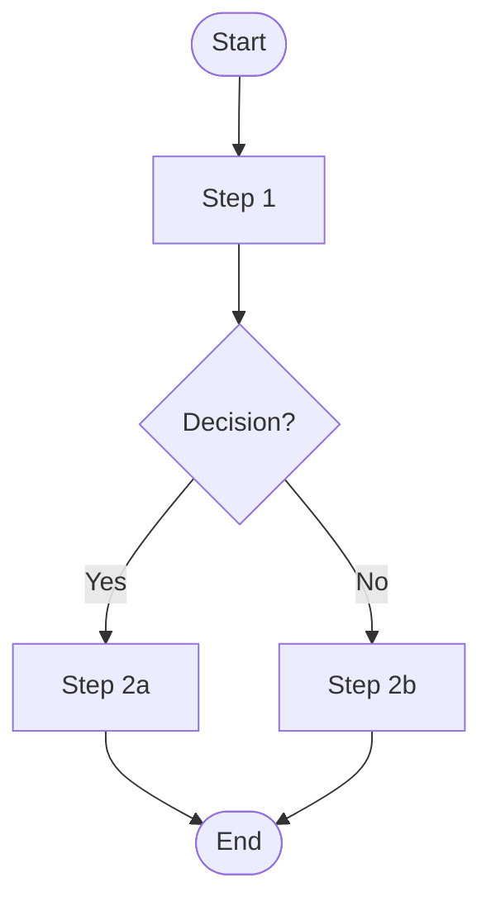

# Functional Requirements Document

| Field | Value |
|-------|-------|
| **Project** | [Project Name] |
| **Version** | 1.0 |
| **Date** | [Date] |
| **Prepared By** | [Author] |
| **Status** | Draft |
| **Source Documents** | [List of input files] |

---

## Table of Contents

1. [Introduction](#1-introduction)
2. [System Overview](#2-system-overview)
3. [Functional Requirements](#3-functional-requirements)
4. [Business Rules](#4-business-rules)
5. [Data Requirements](#5-data-requirements)
6. [Workflows & Process Flows](#6-workflows--process-flows)
7. [Exception & Error Handling](#7-exception--error-handling)
8. [Non-Functional Requirements](#8-non-functional-requirements)
9. [Open Questions & Future Considerations](#9-open-questions--future-considerations)
- [Appendix A: Assumptions Log](#appendix-a-assumptions-log)
- [Appendix B: Source Document Index](#appendix-b-source-document-index)

---

## 1. Introduction

### 1.1 Purpose

This document describes the functional requirements for **[Project Name]**. It serves as the primary reference for the development team, QA team, and stakeholders to understand what the system must do and the business rules it must enforce.

### 1.2 Scope

[Describe what is in scope and explicitly what is out of scope.]

**In scope:**
- [Feature area 1]
- [Feature area 2]

**Out of scope:**
- [Explicitly excluded items]

### 1.3 Definitions & Glossary

| Term | Definition |
|------|-----------|
| [Term 1] | [Plain-language definition] |
| [Term 2] | [Plain-language definition] |

### 1.4 Assumptions & Constraints

> See full assumptions log in [Appendix A](#appendix-a-assumptions-log).

**Key constraints:**
- [Technical constraint, e.g., "Must integrate with existing SAP system"]
- [Business constraint, e.g., "Must comply with GDPR"]

### 1.5 Document Conventions

| Keyword | Meaning |
|---------|---------|
| **MUST** / **SHALL** | The requirement is mandatory |
| **SHOULD** | The requirement is strongly recommended |
| **MAY** / **CAN** | The requirement is optional |
| **TBD** | To be defined — pending stakeholder input |

Requirement IDs follow the format: `[MODULE]-[TYPE]-[NNN]`
- Module: Short code for the feature (e.g., `AUTH`, `ORD`, `USR`)
- Type: `FR` (Functional), `BR` (Business Rule), `DR` (Data), `WF` (Workflow)
- NNN: Sequential number starting at 001

---

## 2. System Overview

### 2.1 Context Description

[2-3 paragraphs describing what the system does, who uses it, and what problem it solves. Written for a non-technical reader.]

### 2.2 Actors & Roles

| Actor | Type | Description | Key Capabilities |
|-------|------|-------------|-----------------|
| [Actor 1] | Human / System | [Description] | [What they can do] |
| [Actor 2] | Human / System | [Description] | [What they can do] |

### 2.3 High-Level Feature Map

| Module | Description | Key Actors |
|--------|-------------|-----------|
| [Module 1] | [Brief description] | [Actors] |
| [Module 2] | [Brief description] | [Actors] |

---

## 3. Functional Requirements

### 3.1 [Module Name]

[Brief description of this module's purpose.]

#### [MODULE]-FR-001 — [Requirement Name]

[Clear, single-sentence statement of what the system must do.]

- [Detail or sub-requirement]
- [Detail or sub-requirement]

**Priority:** High / Medium / Low
**Source:** [filename, section/page]
**Related:** [BR/DR/WF IDs if applicable]

---

## 4. Business Rules

### 4.1 [Module Name] Rules

#### [MODULE]-BR-001 — [Rule Name]

| Attribute | Value |
|-----------|-------|
| **ID** | [MODULE]-BR-001 |
| **Description** | [What the rule states] |
| **Trigger** | [When does this rule apply] |
| **Consequence** | [What happens when the rule is triggered] |
| **Exception** | [Any exceptions to this rule] |
| **Priority** | Must / Should / May |
| **Source** | [filename, location] |

---

## 5. Data Requirements

### 5.1 Data Entities

| Entity | Description | Module |
|--------|-------------|--------|
| [Entity 1] | [Description] | [Module] |

### 5.2 [Entity Name] Fields

| Field | Type | Required | Validation | Default | Notes |
|-------|------|----------|-----------|---------|-------|
| [field] | [type] | Yes/No | [rule] | [value] | [note] |

---

## 6. Workflows & Process Flows

### 6.1 [Workflow Name]

**Description:** [What this workflow accomplishes]
**Actors:** [Who participates]
**Trigger:** [What starts this workflow]

**Steps:**
1. [Step description]
2. [Step description]
3. [Step description]

**Source:** [filename, section]

---

## 7. Exception & Error Handling

| ID | Trigger | System Response | User Message |
|----|---------|----------------|--------------|
| [MODULE]-EX-001 | [What causes the error] | [What system does] | [What user sees] |

---

## 8. Non-Functional Requirements

> *Note: These were identified in the source documents and are captured here for completeness. A dedicated Non-Functional Requirements document may be needed.*

| ID | Category | Requirement | Source |
|----|----------|-------------|--------|
| NF-001 | Performance | [Requirement] | [Source] |
| NF-002 | Security | [Requirement] | [Source] |

---

## 9. Open Questions & Future Considerations

| # | Question | Impact | Raised From | Status |
|---|----------|--------|-------------|--------|
| 1 | [Question] | [Which requirements are blocked] | [Source document] | Open |

---

## Appendix A: Assumptions Log

| # | Assumption | Rationale | Affects |
|---|-----------|-----------|---------|
| 1 | [Assumption made] | [Why this was assumed] | [Requirement IDs] |

---

## Appendix B: Source Document Index

| File | Type | Description | Requirements Extracted |
|------|------|-------------|----------------------|
| [filename] | PDF/DOCX/XLSX | [What the file contains] | [count] |

---

*End of Document*
